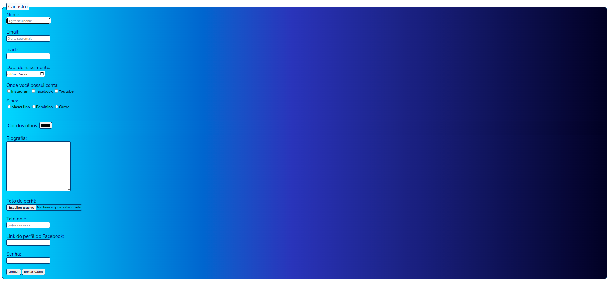
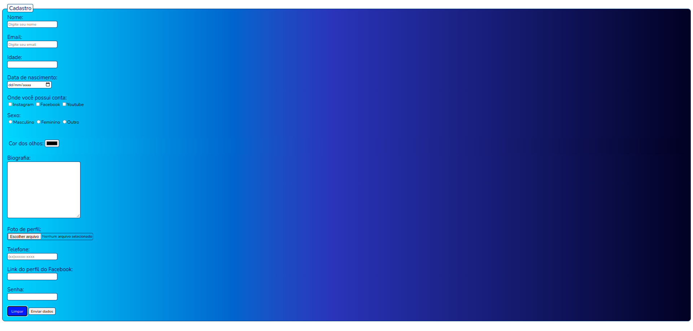

# Cadastro CSS

> Implementando o CSS no cadastro feito no exercício anterior (cadastro HTML).

### Desafios:

- [x] Retirar todas as tags   e manter o layout sem alterações visuais.
- [x] Tirar o fieldset e manter o layout sem alterações visuais
- [x] Alterar a cor da borda de todos os inputs
- [x] Alterar a fonte do projeto para "Nunito"
- [x] Alterar o background do formulário
- [x] Alterar a cor e o tamanho dos textos do labels

-- Ao passar o mouse sobre os botões de <strong>Limpar</strong> e <strong>Enviar</strong> dados:

- [x] Trocar a cor de fundo dos botões
- [x] Aumentar os botões
- [x] Trocar a cor da letra
- [x] Trocar a cor da borda
- [x] O cursor terá que ser o da "mãozinha"

